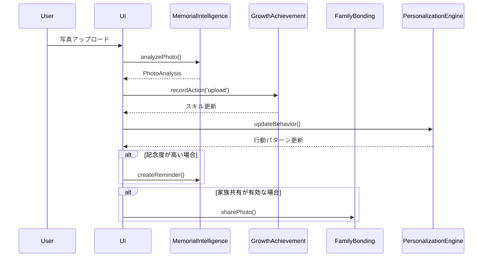
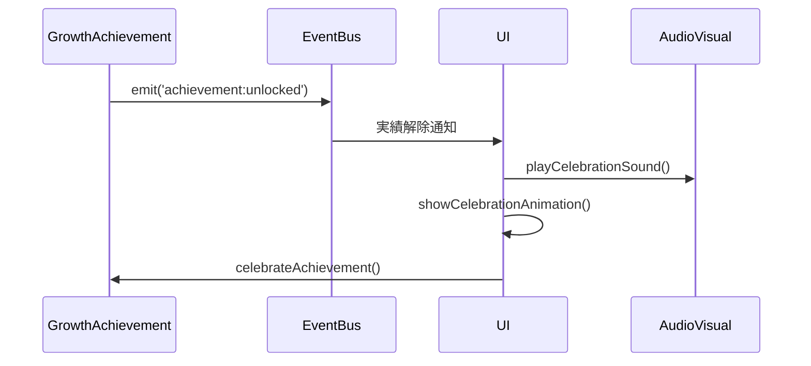

# 長期愛用システム - API仕様書

## Context API 一覧

### 1. PersonalizationContext

ユーザーの行動パターン学習と個性適応システム

#### Provider Props

```typescript
interface PersonalizationContextType {
  // 個性プロファイル
  personalityProfile: PersonalityProfile | null;
  
  // 行動パターン
  behaviorPatterns: BehaviorPattern[];
  
  // スマート提案
  smartSuggestions: SmartSuggestion[];
  
  // メソッド
  updateBehavior: (behavior: Partial<BehaviorPattern>) => Promise<void>;
  generateSuggestions: () => Promise<SmartSuggestion[]>;
  acceptSuggestion: (suggestionId: string) => Promise<void>;
  dismissSuggestion: (suggestionId: string) => Promise<void>;
}
```

#### 使用例

```typescript
const PersonalizedComponent = () => {
  const { 
    personalityProfile, 
    smartSuggestions, 
    acceptSuggestion 
  } = usePersonalization();
  
  // 個性に応じたUI調整
  const interfaceComplexity = personalityProfile?.adaptations.interfaceComplexity || 'standard';
  
  return (
    <div className={`interface-${interfaceComplexity}`}>
      {smartSuggestions.map(suggestion => (
        <SuggestionCard 
          key={suggestion.id}
          suggestion={suggestion}
          onAccept={() => acceptSuggestion(suggestion.id)}
        />
      ))}
    </div>
  );
};
```

### 2. MemorialIntelligenceContext

写真分析と記念日管理システム

#### Provider Props

```typescript
interface MemorialIntelligenceContextType {
  // 写真分析結果
  photoAnalyses: Map<string, PhotoAnalysis>;
  
  // 記念日リマインダー
  memorialReminders: MemorialReminder[];
  
  // 文化的イベント
  upcomingCulturalEvents: CulturalEvent[];
  
  // メソッド
  analyzePhoto: (photoId: string, file: File) => Promise<PhotoAnalysis>;
  createReminder: (reminder: Omit<MemorialReminder, 'id'>) => Promise<void>;
  dismissReminder: (reminderId: string) => Promise<void>;
  getCulturalContext: (date?: Date) => CulturalEvent | null;
}
```

#### 使用例

```typescript
const PhotoUploadComponent = () => {
  const { analyzePhoto, createReminder } = useMemorialIntelligence();
  
  const handlePhotoUpload = async (file: File) => {
    const analysis = await analyzePhoto(`photo-${Date.now()}`, file);
    
    // 記念度が高い場合は自動でリマインダー作成
    if (analysis.memorialSignificance > 0.7) {
      await createReminder({
        type: 'anniversary',
        date: analysis.dateCreated,
        title: `特別な瞬間`,
        message: `${analysis.emotionalContext}の写真を思い出してみませんか？`,
        significance: analysis.memorialSignificance,
        isRecurring: true,
        recurrenceType: 'yearly'
      });
    }
  };
  
  return (
    <input 
      type="file" 
      onChange={(e) => e.target.files?.[0] && handlePhotoUpload(e.target.files[0])}
      accept="image/*"
    />
  );
};
```

### 3. GrowthAchievementContext

スキル追跡と実績システム

#### Provider Props

```typescript
interface GrowthAchievementContextType {
  // 現在のスキルメトリクス
  skillMetrics: SkillMetrics;
  
  // 実績データ
  achievements: Achievement[];
  unlockedAchievements: string[];
  
  // 進歩履歴
  progressHistory: ProgressHistory[];
  
  // 統計情報
  stats: {
    totalActions: number;
    currentStreak: number;
    longestStreak: number;
    daysActive: number;
  };
  
  // メソッド
  recordAction: (actionType: string, quality?: number) => Promise<void>;
  getProgressSince: (date: Date) => ProgressHistory[];
  getEncouragement: () => string;
  celebrateAchievement: (achievementId: string) => Promise<void>;
}
```

#### 使用例

```typescript
const PhotoEditorComponent = () => {
  const { 
    skillMetrics, 
    recordAction, 
    getEncouragement,
    achievements,
    unlockedAchievements
  } = useGrowthAchievement();
  
  const handleEditAction = async (type: string) => {
    await recordAction(type, 0.8); // 品質スコア付きでアクション記録
    
    // 新しい実績チェック
    const newAchievements = achievements.filter(
      a => !unlockedAchievements.includes(a.id)
    );
    
    if (newAchievements.length > 0) {
      // 実績解除の祝賀
      console.log('新しい実績が解除されました！', newAchievements[0]);
    }
  };
  
  return (
    <div className="photo-editor">
      <SkillIndicator metrics={skillMetrics} />
      <EncouragementMessage message={getEncouragement()} />
      
      <button onClick={() => handleEditAction('color')}>
        色調整
      </button>
      <button onClick={() => handleEditAction('composition')}>
        構図調整
      </button>
    </div>
  );
};
```

### 4. FamilyBondingContext

家族共有と絆システム

#### Provider Props

```typescript
interface FamilyBondingContextType {
  // 家族メンバー
  familyMembers: FamilyMember[];
  currentUser: FamilyMember | null;
  
  // 共有写真
  sharedPhotos: SharedPhoto[];
  
  // 世代間知恵
  wisdomEntries: WisdomEntry[];
  
  // メソッド
  inviteFamilyMember: (name: string, role: string) => Promise<string>;
  sharePhoto: (photoId: string, caption?: string) => Promise<void>;
  reactToPhoto: (photoId: string, reaction: string) => Promise<void>;
  commentOnPhoto: (photoId: string, comment: string) => Promise<void>;
  shareWisdom: (wisdom: Omit<WisdomEntry, 'id' | 'createdAt'>) => Promise<void>;
  getFamilyTimeline: () => SharedPhoto[];
}
```

#### 使用例

```typescript
const FamilyGalleryComponent = () => {
  const { 
    sharedPhotos, 
    familyMembers, 
    reactToPhoto, 
    commentOnPhoto,
    wisdomEntries 
  } = useFamilyBonding();
  
  const handleReaction = async (photoId: string, reaction: string) => {
    await reactToPhoto(photoId, reaction);
    // リアクション送信後の更新は自動で行われる
  };
  
  return (
    <div className="family-gallery">
      {sharedPhotos.map(photo => (
        <div key={photo.id} className="shared-photo">
          
          <p>{photo.caption}</p>
          
          <div className="reactions">
            {['❤️', '😊', '👏', '😢', '🙏', '🌸'].map(emoji => (
              <button 
                key={emoji}
                onClick={() => handleReaction(photo.id, emoji)}
              >
                {emoji}
              </button>
            ))}
          </div>
          
          <div className="comments">
            {photo.comments.map(comment => {
              const member = familyMembers.find(m => m.id === comment.memberId);
              return (
                <div key={comment.id}>
                  <strong>{member?.name}</strong>: {comment.text}
                  {comment.isWisdom && <span className="wisdom-badge">🌟</span>}
                </div>
              );
            })}
          </div>
        </div>
      ))}
      
      <WisdomSection entries={wisdomEntries} />
    </div>
  );
};
```

### 5. SeasonalAudioVisualContext

季節的音響視覚強化システム

```typescript
interface SeasonalAudioVisualContextType {
  // 現在の状態
  currentSeason: Season;
  currentTrack: AudioTrack | null;
  isPlaying: boolean;
  volume: number;
  
  // 視覚効果
  particleEffectsEnabled: boolean;
  currentParticleEffect: ParticleEffect | null;
  
  // メソッド
  playOptimalAudio: (mood?: string) => Promise<void>;
  stopAudio: () => void;
  setVolume: (volume: number) => void;
  enableParticleEffects: (enabled: boolean) => void;
  getSeasonalTheme: () => {
    colors: string[];
    mood: string;
    emoji: string;
  };
}
```

## ユーティリティ関数 API

### 時間・季節関連

```typescript
// 現在の季節取得
getCurrentSeason(): Season

// 季節の絵文字取得
getSeasonalEmoji(season: Season): string

// 季節の色パレット取得
getSeasonalColors(season: Season): string[]

// 時間帯取得
getTimeOfDay(): 'morning' | 'afternoon' | 'evening' | 'night'

// 文化的特別期間判定
isSpecialCulturalPeriod(date?: Date): CulturalEvent | null
```

### スキル計算関連

```typescript
// スキルレベル計算
calculateSkillLevel(value: number): 'beginner' | 'intermediate' | 'advanced' | 'expert'

// 総合スキルスコア計算
calculateOverallSkillScore(metrics: SkillMetrics): number

// スキル改善適用
applySkillImprovement(
  currentMetrics: SkillMetrics, 
  actionType: string,
  quality?: number
): SkillMetrics

// 励ましメッセージ取得
getEncouragementMessage(skillLevel: string): string
```

### 実績システム関連

```typescript
// 達成可能な実績チェック
checkAchievements(
  metrics: SkillMetrics,
  actionsCount: number,
  streakDays: number,
  daysActive: number,
  unlockedAchievements?: string[]
): Achievement[]

// 実績進捗計算
calculateAchievementProgress(
  achievement: Achievement,
  metrics: SkillMetrics,
  actionsCount: number,
  streakDays: number,
  daysActive: number
): number
```

### パーソナライゼーション関連

```typescript
// 行動からの性格特性更新
updatePersonalityFromBehavior(
  currentProfile: PersonalityProfile,
  behaviorData: BehaviorData
): PersonalityProfile

// 最適音楽選択
selectOptimalAudio(
  season?: Season,
  timeOfDay?: string,
  mood?: string,
  personalityProfile?: PersonalityProfile
): AudioTrack | null
```

### データ永続化関連

```typescript
// IndexedDBへの安全保存
saveToIndexedDB(storeName: string, data: any): Promise<void>

// IndexedDBからの読み込み
loadFromIndexedDB<T>(storeName: string, id: string): Promise<T | null>

// データ整合性チェック
validateEngagementData(data: any): boolean
```

## イベントシステム

### Context間の通信

```typescript
// グローバルイベントバス
interface EngagementEventBus {
  // 実績解除時
  'achievement:unlocked': { achievementId: string; user: string };
  
  // 写真共有時
  'photo:shared': { photoId: string; familyMembers: string[] };
  
  // スキル向上時
  'skill:improved': { skill: string; oldValue: number; newValue: number };
  
  // 記念日検出時
  'memorial:detected': { photoId: string; significance: number };
  
  // 季節変化時
  'season:changed': { from: Season; to: Season };
}

// イベント購読
const useEngagementEvents = () => {
  const { subscribe, unsubscribe, emit } = useContext(EngagementEventContext);
  
  useEffect(() => {
    const handleAchievement = (data) => {
      // 実績解除時の処理
      showCelebration(data.achievementId);
    };
    
    subscribe('achievement:unlocked', handleAchievement);
    return () => unsubscribe('achievement:unlocked', handleAchievement);
  }, []);
  
  return { emit };
};
```

## データフロー

### 1. 写真アップロード時のフロー



### 2. 実績解除時のフロー



## エラーハンドリング

### 標準エラー処理

```typescript
interface EngagementError {
  code: string;
  message: string;
  context?: any;
  recoverable: boolean;
}

// エラーハンドリング例
const useGrowthAchievement = () => {
  const [error, setError] = useState<EngagementError | null>(null);
  
  const recordAction = async (actionType: string, quality?: number) => {
    try {
      await recordActionInternal(actionType, quality);
      setError(null);
    } catch (err) {
      const engagementError: EngagementError = {
        code: 'SKILL_UPDATE_FAILED',
        message: 'スキル更新に失敗しました',
        context: { actionType, quality },
        recoverable: true
      };
      setError(engagementError);
      
      // 回復可能なエラーの場合はリトライ
      if (engagementError.recoverable) {
        setTimeout(() => recordAction(actionType, quality), 5000);
      }
    }
  };
  
  return { recordAction, error };
};
```

### 共通エラーコード

- `STORAGE_FULL`: ローカルストレージ容量不足
- `SYNC_FAILED`: 同期処理失敗
- `INVALID_DATA`: データ形式エラー
- `PERMISSION_DENIED`: 権限不足
- `NETWORK_ERROR`: ネットワークエラー
- `ANALYSIS_FAILED`: 写真分析失敗
- `SKILL_UPDATE_FAILED`: スキル更新失敗

## テスト戦略

### 単体テスト例

```typescript
describe('GrowthAchievementContext', () => {
  test('should record action and update skills', async () => {
    const { result } = renderHook(() => useGrowthAchievement(), {
      wrapper: GrowthAchievementProvider
    });
    
    await act(async () => {
      await result.current.recordAction('edit', 0.8);
    });
    
    expect(result.current.skillMetrics.editing_speed).toBeGreaterThan(0.1);
  });
  
  test('should unlock achievement when threshold is met', async () => {
    const { result } = renderHook(() => useGrowthAchievement());
    
    // スキルレベルを閾値まで上げる
    for (let i = 0; i < 50; i++) {
      await act(async () => {
        await result.current.recordAction('edit', 0.9);
      });
    }
    
    expect(result.current.unlockedAchievements).toContain('speed-learner');
  });
});
```

### 統合テスト例

```typescript
describe('Full Engagement Flow', () => {
  test('should complete photo upload to family sharing flow', async () => {
    render(
      <PersonalizationProvider>
        <MemorialIntelligenceProvider>
          <FamilyBondingProvider>
            <PhotoUploadComponent />
          </FamilyBondingProvider>
        </MemorialIntelligenceProvider>
      </PersonalizationProvider>
    );
    
    const fileInput = screen.getByRole('textbox');
    const file = new File(['photo'], 'test.jpg', { type: 'image/jpeg' });
    
    await user.upload(fileInput, file);
    
    // 写真分析結果の確認
    await waitFor(() => {
      expect(screen.getByText(/記念度/)).toBeInTheDocument();
    });
    
    // 家族共有の確認
    await waitFor(() => {
      expect(screen.getByText(/家族と共有/)).toBeInTheDocument();
    });
  });
});
```

この API 仕様書により、長期愛用システムの全機能を適切に利用することができます。